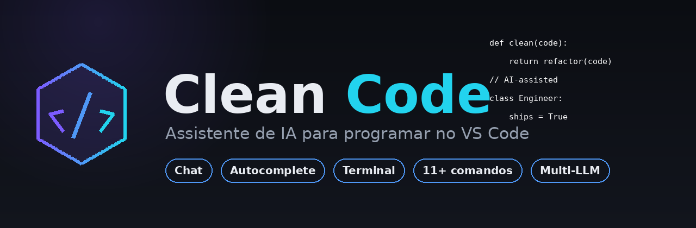

<div align="center">



# Clean Code — Assistente de IA para o VS Code

**Programe mais rápido e com mais qualidade.** Chat com contexto, autocomplete inline,
ajuda no terminal e comandos de IA para criar, corrigir, refatorar, documentar e revisar
código — em **qualquer linguagem**, direto no seu editor.


</div>

---

## 💡 Por que Clean Code?

O **Clean Code** trabalha ao seu lado como um **engenheiro de software sênior**: entende o
contexto do seu projeto, sugere código enquanto você digita, responde perguntas no chat e
executa tarefas complexas com um clique. Ele foi feito para **acelerar dev júnior a sênior** —
do primeiro `hello world` ao refactor de um microserviço.

- ⚡ **Rápido** — respostas e sugestões em segundos.
- 🧠 **Consciente do contexto** — lê o arquivo aberto, a seleção e os erros automaticamente.
- 🌍 **Poliglota** — Python, JavaScript, TypeScript, Java, C, C++, C#, Go, Rust, PHP, Kotlin, Swift e mais.
- 🔌 **Multi-LLM** — nuvem (Claude, GPT, Gemini, Groq, DeepSeek) e modelos locais (Ollama).
- 🆓 **Gratuito** para começar.

---

## ✨ Recursos

### 💬 Chat integrado (com o seu código)
Um chat na barra lateral, no estilo Copilot Chat / Claude. Tem **histórico**, **memória** e
seletor de modo (Auto / Cloud / Local). Selecione um trecho de código, aperte **`Cmd/Ctrl+L`**
e o chat abre **já com o seu código anexado** — é só escrever a pergunta. (estilo Blackbox)

### ⚡ Autocomplete inline
Sugestões em **texto cinza (ghost text)** enquanto você digita, como no GitHub Copilot.
Aperte **Tab** para aceitar. Debounce e cache inteligentes para não atrapalhar a digitação.

### 💻 Ajuda no terminal
Selecionou um erro no terminal? Clique com o botão direito → **Clean Code: Ajuda com o Terminal**
(ou **`Cmd/Ctrl+Alt+T`**). Ele lê a saída e responde com **o comando exato** para resolver.

### 🧰 Comandos de um clique
Selecione o código e use o menu de contexto **Clean Code** ou a paleta de comandos para
**explicar, corrigir, refatorar, documentar, comentar, otimizar, revisar, testar, converter
de linguagem** e **analisar segurança**.

---

## 🎬 Demonstração

> _Dica: grave um GIF curto usando a extensão e salve como `media/demo.gif`, depois adicione
> `` aqui. Extensões com demonstração recebem muito mais instalações._

---

## ⌨️ Atalhos

| Atalho (Mac / Win-Linux)      | Ação                                             |
|-------------------------------|--------------------------------------------------|
| `Cmd+Shift+I` / `Ctrl+Shift+I`| Abrir o chat                                     |
| `Cmd+L` / `Ctrl+L`            | Perguntar sobre o código selecionado             |
| `Cmd+Alt+T` / `Ctrl+Alt+T`    | Ajuda com o terminal (com o texto selecionado)   |
| `Tab`                         | Aceitar a sugestão de autocomplete               |

---

## 🧰 Comandos

Disponíveis no **menu de contexto do editor** (Clean Code), na **paleta** (`Cmd/Ctrl+Shift+P`)
e como **slash commands** no chat.

| Comando       | O que faz                                            |
|---------------|------------------------------------------------------|
| `/create`     | Cria projetos, arquivos e estruturas completas       |
| `/explain`    | Explica o código de forma objetiva                   |
| `/fix`        | Encontra e corrige erros                              |
| `/refactor`   | Refatora melhorando legibilidade e desempenho        |
| `/document`   | Gera documentação / docstrings                       |
| `/comment`    | Adiciona comentários explicativos                    |
| `/optimize`   | Otimiza o desempenho e aponta os ganhos              |
| `/review`     | Faz um code review de sênior por severidade          |
| `/test`       | Gera testes automatizados                            |
| `/convert`    | Converte o código para outra linguagem               |
| `/security`   | Analisa vulnerabilidades de segurança                |
| `/terminal`   | Diagnostica saída de terminal e dá o comando certo   |
| `/commit`     | Sugere mensagem de commit (Conventional Commits)     |

---

## 🚀 Instalação

1. Instale a extensão pelo Marketplace (ou via `.vsix`).
2. Abra as **Configurações** (`Cmd/Ctrl+,`) e procure por **Clean Code**.
3. Preencha:
   - **Backend Url** — endereço do servidor Clean Code.
   - **Api Key** — sua chave de acesso (se o servidor exigir).
4. Clique no ícone do **Clean Code** na barra lateral e comece. ✅

---

## ⚙️ Configurações

| Configuração                    | Padrão                     | Descrição                                  |
|---------------------------------|----------------------------|--------------------------------------------|
| `cleancode.backendUrl`          | *(servidor hospedado)*     | Endereço do servidor de IA                 |
| `cleancode.apiKey`              | vazio                      | Chave de acesso ao servidor                |
| `cleancode.preferredMode`       | `auto`                     | `auto` / `cloud` / `local`                 |
| `cleancode.completion.enabled`  | `true`                     | Liga/desliga o autocomplete                |
| `cleancode.completion.debounceMs`| `350`                     | Atraso antes de sugerir                    |

---

## 🌐 Como funciona

A extensão é um cliente leve que conversa com o **servidor Clean Code**, que por sua vez
roteia para o melhor modelo de IA disponível:

```
Você digita / pergunta  →  Extensão (VS Code)  →  Servidor Clean Code
                                                        │
                        online → modelo em nuvem  ◄─────┤
                        offline → modelo local (Ollama) ◄┘
```

Quando há internet, usa um modelo em nuvem; sem internet, cai para um modelo local. Você nunca
fica sem assistente.

---

## 🗺️ Linguagens suportadas

Python · JavaScript · TypeScript · Java · C · C++ · C# · Go · Rust · PHP · Kotlin · Swift ·
Ruby · SQL · HTML · CSS · React · Vue · Angular · Bash — e praticamente qualquer linguagem
que você abrir no editor.

---

## 🔒 Privacidade

O código enviado para análise é processado pelo servidor configurado em `backendUrl` e pelo
provedor de IA escolhido. Use um serviço de sua confiança e evite enviar segredos/credenciais.

---

## 🧩 Roadmap

- [ ] Respostas em streaming (token a token) no chat
- [ ] Aplicar mudanças diretamente no arquivo (com confirmação)
- [ ] Memória semântica do projeto (RAG / embeddings)
- [ ] Suporte a JetBrains (IntelliJ, PyCharm)

---

<div align="center">

**Clean Code** · Feito para desenvolvedores · [MIT](../LICENSE)

</div>
